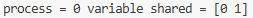
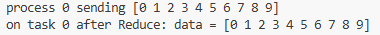
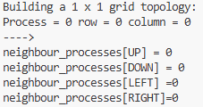

# Chapter 4
# PRINCE IRSHAD (23FA-035-CS)
---

## Table of Contents
* [1. helloworld_MPI](#1-helloworld_mpi)
* [2. broadcast](#2-broadcast)
* [3. scatter](#3-scatter)
* [4. gather](#4-gather)
* [5. alltoall](#5-alltoall)
* [6. reduction](#6-reduction)
* [7. pointToPointCommunication](#7-pointtopointcommunication)
* [8. deadLockProblems](#8-deadlockproblems)
* [9. virtualTopology](#9-virtualtopology)

---

#### 1. helloworld_MPI
* **What I Learned:** I learned the fundamental setup of an MPI (Message Passing Interface) environment. This script introduces how multiple processes are launched simultaneously and how each process identifies itself within a shared communicator group using ranks.
* **How it Executes:** When executed via `mpiexec`, the MPI environment clones the script across the specified number of cores. Each instance runs the code independently, fetches its unique rank from the communicator, and prints a greeting message.
* **Code Understanding:** * `MPI.COMM_WORLD` represents the default group containing all processes.
  * `comm.Get_rank()` retrieves the unique ID of the process (starting from 0).
* **End Use:** Used as a diagnostic tool to verify that the MPI cluster or multi-core environment is correctly configured and that all nodes can communicate.
* **Short Summary:** A basic entry-level script that demonstrates the SPMD (Single Program, Multiple Data) model by having multiple processes report their presence.
* **Pros & Cons:** * **Advantages:** Extremely simple to implement and perfect for testing environment connectivity.
  * **Disadvantages:** Does not involve any actual data exchange between processes.
* **Output:** 

---

#### 2. broadcast
* **What I Learned:** I learned the "One-to-All" communication pattern. This is used when a single source process (Root) needs to share a specific piece of data with every other process in the communicator simultaneously.
* **How it Executes:** The Root process (rank 0) initializes a variable with a value. All other processes start with the variable as `None`. After the `.bcast()` call, the value from the Root is copied to the memory space of every other rank.
* **Code Understanding:** * `comm.bcast(data, root=0)` is a collective call. It handles both sending (for the root) and receiving (for others) in a single line.
* **End Use:** Ideal for sending configuration parameters, initial weights in a machine learning model, or global constants to all workers at once.
* **Short Summary:** Demonstrates how to efficiently synchronize a single piece of information across an entire parallel network.
* **Pros & Cons:** * **Advantages:** Much faster and more efficient than sending the same data manually to each process one by one.
  * **Disadvantages:** Uses unnecessary memory if only a few processes actually need the data.
* **Output:** 

---

#### 3. scatter
* **What I Learned:** I learned how to divide a large dataset and distribute unique chunks to different workers. Unlike broadcasting, each process receives a different, unique part of the original data array.
* **How it Executes:** The Root process holds a list or array. The `.scatter()` function chops this list into equal parts (based on the total number of processes) and sends the $i$-th element to the $i$-th rank.
* **Code Understanding:** * `comm.scatter(array, root=0)` distributes the elements. The size of the array must match the number of processes (`size`).
* **End Use:** Essential for "Data Parallelism" where you want to split a large task (like a big calculation) so each core works on a different section.
* **Short Summary:** This script demonstrates the distribution of a workload by splitting an array across all available processes.
* **Pros & Cons:** * **Advantages:** Prevents redundant processing by giving each worker a unique task.
  * **Disadvantages:** The input array size must be perfectly divisible by the number of processes to avoid errors.
* **Output:** 

---

#### 4. gather
* **What I Learned:** I learned the "All-to-One" pattern, which is the exact opposite of Scatter. It is used to collect individual results from all workers and combine them into a single list on the Root process.
* **How it Executes:** Each process performs a calculation (e.g., squaring its rank). Then, `.gather()` is called, which pulls these individual values back to rank 0, placing them in an array in the order of the ranks.
* **Code Understanding:** * `comm.gather(data, root=0)` collects the values. On rank 0, the result is a list; on other ranks, it is usually `None`.
* **End Use:** Used at the end of a parallel computation to compile final results, such as gathering local sums to calculate a global total.
* **Short Summary:** Demonstrates the aggregation of distributed data back into a single centralized process for final reporting.
* **Pros & Cons:** * **Advantages:** Simplifies the collection of results without needing multiple individual send/receive calls.
  * **Disadvantages:** If the gathered data is huge, the Root process might run out of memory (RAM).
* **Output:** 

---

#### 5. alltoall
* **What I Learned:** I learned the "Many-to-Many" communication pattern. This is a complex exchange where every process sends a piece of data to every other process and receives data from them in return.
* **How it Executes:** Every process prepares an array. After `.Alltoall()`, the $j$-th element of process $i$ is sent to process $j$ and becomes the $i$-th element of that process's received buffer.
* **Code Understanding:** * `comm.Alltoall(sendbuf, recvbuf)` acts like a matrix transpose across the processes.
* **End Use:** Heavily used in complex scientific algorithms like Fast Fourier Transforms (FFT) or sorting where every node needs info from every other node.
* **Short Summary:** A powerful synchronization script showing a total exchange of data across the entire communicator group.
* **Pros & Cons:** * **Advantages:** Replaces $N^2$ individual messages with a single highly optimized collective call.
  * **Disadvantages:** High network overhead; it can slow down significantly if the number of processes is very large.
* **Output:** 

---

#### 6. reduction
* **What I Learned:** I learned how to perform mathematical operations (like Sum, Max, or Min) across distributed data while collecting it. It combines gathering and computation into one step.
* **How it Executes:** Each process generates a local value. The `.Reduce()` function collects these values to the Root and applies a specified operator (like `MPI.SUM`) to them along the way.
* **Code Understanding:** * `op=MPI.SUM` tells the MPI engine to add the values together during the collection process.
* **End Use:** Standard for calculating global statistics, such as finding the average temperature from a million sensors or finding the maximum value in a dataset.
* **Short Summary:** Showcases an efficient way to perform global mathematical aggregations across multiple CPU cores.
* **Pros & Cons:** * **Advantages:** Extremely memory efficient because it doesn't store all individual values; it only keeps the running result.
  * **Disadvantages:** Limited to predefined MPI operations (Sum, Prod, Max, Min, etc.).
* **Output:** 

---

#### 7. pointToPointCommunication
* **What I Learned:** I learned how to handle direct "One-to-One" messages. This is the most basic form of communication where a specific sender targets a specific receiver.
* **How it Executes:** The script uses `if` statements to define behavior for specific ranks. Rank 0 sends data to Rank 4, and Rank 1 sends data to Rank 8. The receiving ranks must be ready with a `.recv()` call.
* **Code Understanding:** * `comm.send(data, dest=...)` initiates the transfer.
  * `comm.recv(source=...)` blocks the receiver until the data arrives.
* **End Use:** Used for custom protocols, master-worker architectures, or passing specific signals between neighbor nodes.
* **Short Summary:** Demonstrates targeted communication between specific process pairs without involving the rest of the group.
* **Pros & Cons:** * **Advantages:** Offers maximum control over exactly who gets what data and when.
  * **Disadvantages:** Risk of "Deadlocks" if the send/receive calls are not perfectly matched.
* **Output:** 

---

#### 8. deadLockProblems
* **What I Learned:** I learned about the biggest danger in MPI: the **Deadlock**. This happens when two processes are both waiting for each other to send data, resulting in the program freezing forever.
* **How it Executes:** Two processes (Rank 1 and 5) both try to `recv()` data before they `send()` anything. Since both are waiting, neither ever reaches the `send()` line, and the code hangs indefinitely.
* **Code Understanding:** * The order of `comm.send` and `comm.recv` is critical. To fix a deadlock, one process should send first while the other receives first.
* **End Use:** This script serves as a "Negative Example" to teach developers how to avoid blocking the execution flow in parallel systems.
* **Short Summary:** A critical lesson in process synchronization, highlighting how incorrect communication ordering can freeze a parallel application.
* **Pros & Cons:** * **Advantages:** Teaches essential debugging skills for high-performance computing.
  * **Disadvantages:** If not handled, deadlocks can waste massive amounts of computational resources.
* **Output:**

---

#### 9. virtualTopology
* **What I Learned:** I learned how to organize processes into a logical shape, specifically a 2D Grid (Cartesian Topology). This makes it easier to manage processes that represent physical spaces.
* **How it Executes:** The script calculates a grid size (Rows x Columns). It then uses `Create_cart` to map ranks to X,Y coordinates and uses `Shift` to automatically find neighbors (Up, Down, Left, Right).
* **Code Understanding:** * `comm.Create_cart` creates the grid. 
  * `periods=(True, True)` allows the grid to wrap around (Top connects to Bottom).
* **End Use:** Used in weather forecasting, fluid dynamics, and physics simulations where each process handles one tile of a map.
* **Short Summary:** Demonstrates an advanced way to map processes into a spatial structure for easier neighbor-to-neighbor communication.
* **Pros & Cons:** * **Advantages:** Makes neighbor-based logic much cleaner and easier to write than manual rank calculations.
  * **Disadvantages:** Adds a layer of complexity to the initial communicator setup.
* **Output:** 

