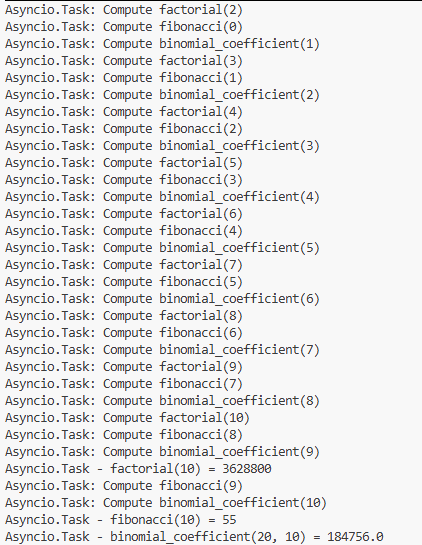
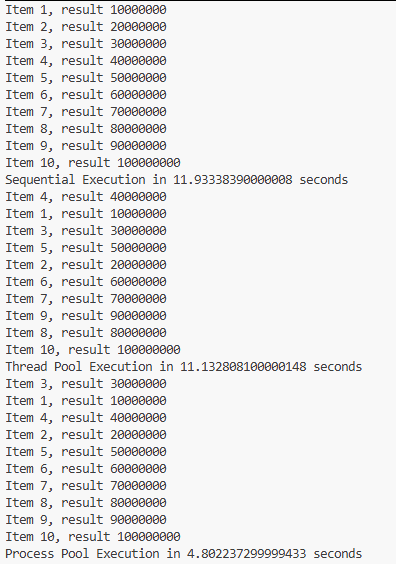

# Chapter 5
# PRINCE IRSHAD (23FA-035-CS)
---

## Table of Contents
* [1. asyncio_and_futures](#1-asyncio_and_futures)
* [2. asyncio_coroutine](#2-asyncio_coroutine)
* [3. asyncio_event_loop](#3-asyncio_event_loop)
* [4. asyncio_task_manipulation](#4-asyncio_task_manipulation)
* [5. concurrent_futures_pooling](#5-concurrent_futures_pooling)

---

#### 1. asyncio_and_futures
* **What I Learned:** I learned how to use the modern `asyncio` library to manage background tasks (coroutines) and how to handle `Futures`. I also learned how to take dynamic inputs directly from the terminal using system arguments (`sys.argv`).
* **How it Executes:** When executed from the terminal with two numbers, the script starts two separate background tasks (one calculates a sum, the other a factorial). Because they are asynchronous, they do not wait for each other to finish. Once a task completes, a callback function is automatically triggered to print its result.
* **Code Understanding:** * `asyncio.create_task()` schedules a coroutine to run in the background immediately.
  * `task.add_done_callback()` acts as an event listener that automatically runs a function the exact moment the task hits 100% completion.
  * `await asyncio.gather()` pauses the main script, forcing it to wait until all grouped tasks are completely finished before moving on.
* **End Use:** Great for applications where you need to run independent background tasks, like downloading multiple files or fetching data from APIs, without freezing the main program.
* **Short Summary:** A basic setup for modern asynchronous programming that demonstrates how to run background tasks and trigger automatic result handling.
* **Pros & Cons:** * **Advantages:** Prevents the program from freezing and utilizes the CPU's idle waiting time efficiently.
  * **Disadvantages:** If the user clicks the run button in VS Code without providing terminal arguments, the script will crash with an `IndexError`.
* **Output:** 

---

#### 2. asyncio_coroutine
* **What I Learned:** I learned how to simulate a Finite State Machine (FSM) using asynchronous coroutines. This demonstrates how a program can dynamically and conditionally jump from one state to another until a final condition is met.
* **How it Executes:** The program starts at the `start_state`. Inside each state, a random number (0 or 1) is generated. This number acts as a decision-maker, telling the program which state to jump to next. The process keeps jumping randomly between states (pausing for 1 second each time) until it randomly triggers the `end_state`.
* **Code Understanding:** * Every state is defined as an `async def` function that uses `await` to conditionally call the next state.
  * `random.randint(0, 1)` provides the random conditional logic that changes the path of the state machine.
* **End Use:** Highly useful for designing complex logic flows, AI behaviors in video games, or network protocols where the application must react differently based on its current status.
* **Short Summary:** A state-driven architecture script showing multiple asynchronous states dynamically communicating and transitioning based on random conditions.
* **Pros & Cons:** * **Advantages:** Provides a highly flexible approach to building dynamic workflows and managing complex conditional paths.
  * **Disadvantages:** If the logic required to reach the `end_state` is flawed, the script could get stuck in an infinite loop forever.
* **Output:** 

---

#### 3. asyncio_event_loop
* **What I Learned:** I learned how to build asynchronous execution loops and cyclic dependency chains. This teaches how background tasks can dynamically schedule each other while respecting a strict global time limit.
* **How it Executes:** Task A runs, pauses randomly, and then schedules Task B in the background. Task B does the same and schedules Task C. Task C then schedules Task A again, creating an infinite cycle. However, before scheduling the next task, they always check the main event loop clock. Once the 5-second deadline passes, they stop scheduling.
* **Code Understanding:** * `asyncio.get_running_loop()` fetches the active event loop, which acts as the master timekeeper.
  * `loop.time() + 1.0 < end_time` is the critical condition that ensures a new task is only scheduled if there is enough time left before the deadline.
* **End Use:** Ideal for background monitoring systems, server health checks, or data polling mechanisms where tasks need to run continuously for a specific duration.
* **Short Summary:** Uses the event loop clock to create a continuous, self-scheduling cycle of background tasks that strictly obeys a hard time deadline.
* **Pros & Cons:** * **Advantages:** Grants developers precise control over execution loops and timing, which is essential for time-sensitive operations.
  * **Disadvantages:** If the main program is not properly kept alive (using `await asyncio.sleep()`), the background cycle will be abruptly destroyed before finishing.
* **Output:** 

---

#### 4. asyncio_task_manipulation
* **What I Learned:** I learned the real power of Asynchronous Concurrency by observing multiple heavy mathematical operations (Factorial, Fibonacci, Binomial Coefficient) sharing CPU time without blocking each other.
* **How it Executes:** All three mathematical functions are scheduled as background tasks simultaneously. Whenever one function hits `await asyncio.sleep(1)` inside its calculation loop, the CPU does not sit idle. Instead, it instantly switches its focus to continue calculating the next math function.
* **Code Understanding:** * `tasks = [...]` is a list holding the three complex coroutines.
  * `await asyncio.sleep(1)` acts as a intentional context switch, explicitly telling the CPU to go work on another task for a moment.
  * `asyncio.gather(*tasks)` launches all tasks in parallel and synchronizes them at the end.
* **End Use:** Best suited for programs that handle multiple simultaneous network requests, web scraping operations, or database queries where waiting is expected.
* **Short Summary:** An advanced demonstration of concurrency where three distinct algorithms share CPU time to execute asynchronously without blocking the main thread.
* **Pros & Cons:** * **Advantages:** Completely eliminates CPU idle time; when one task is forced to wait, another immediately takes over.
  * **Disadvantages:** For purely heavy math (CPU-bound) tasks without sleep delays, `asyncio` is not as fast as true Process Pooling, because it still relies on a single CPU core.
* **Output:** 

---

#### 5. concurrent_futures_pooling
* **What I Learned:** I learned how to compare the three primary execution models in Python: Sequential, Thread Pooling, and Process Pooling. This provides practical benchmarking to understand which method handles heavy calculations the fastest.
* **How it Executes:** The script runs a massive mathematical loop (counting to 10 million) for a list of numbers. First, it does it one-by-one (Sequential). Then, it splits the work across 5 threads running on the same core. Finally, it splits the work across 5 entirely separate CPU cores (Process Pool). The time taken for each method is recorded and printed.
* **Code Understanding:** * `time.perf_counter()` acts as a high-resolution stopwatch to accurately measure the execution duration of each method.
  * `concurrent.futures.ThreadPoolExecutor` creates multiple virtual workers sharing a single CPU core.
  * `concurrent.futures.ProcessPoolExecutor` spawns completely independent workers across multiple physical CPU cores.
* **End Use:** Essential for data science, video rendering, AI training, or any scenario requiring massive parallelism and hardware optimization.
* **Short Summary:** A benchmark script proving that for heavy mathematical (CPU-bound) workloads, Process Pooling is significantly faster than Thread Pooling and Sequential execution.
* **Pros & Cons:** * **Advantages:** Gives developers clear insight into hardware utilization, helping them choose the perfect architecture for their specific workload.
  * **Disadvantages:** Process Pooling consumes significantly more RAM because every process creates a completely new, isolated instance of Python in memory.
* **Output:** 

