# Chapter 6
# PRINCE IRSHAD (23FA-035-CS)
---

## Table of Contents
* [1. CELERY DIRECTORY](#1-celery-directory)
  * [addTask.py](#addtaskpy)
  * [addTask_main.py](#addtask_mainpy)
* [2. PYRO4 DIRECTORY](#2-pyro4-directory)
  * [FIRST EXAMPLE](#first-example)
    * [pyro_client.py](#pyro_clientpy)
    * [pyro_server.py](#pyro_serverpy)
  * [SECOND EXAMPLE (CHAIN TOPOLOGY)](#second-example-chain-topology)
    * [chainTopology.py](#chaintopologypy)
    * [client_chain.py](#client_chainpy)
    * [server_chain_1.py](#server_chain_1py)
    * [server_chain_2.py](#server_chain_2py)
    * [server_chain_3.py](#server_chain_3py)
* [3. SOCKET DIRECTORY](#3-socket-directory)
  * [AddTask.py](#addtaskpy-1)
  * [addTask_main.py](#addtask_mainpy-1)
  * [client.py](#clientpy)
  * [client2.py](#client2py)
  * [server.py](#serverpy)
  * [server2.py](#server2py)

---

## 1. CELERY DIRECTORY

### addTask.py
* **What I Learned:** I learned how to initialize a basic distributed task producer using the Celery framework and how to register a standalone mathematical function as a background queue component linked to an AMQP transport broker.
* **How it Executes:** The script creates a dedicated Celery instance and wraps the arithmetic logic. It remains passive locally until another script calls its decorated name, waiting to register the task details on the messaging network.
* **Code Understanding:** * `Celery('addTask', broker='amqp://guest@localhost//')` sets up the primary core connection to the messaging backend using standard host pathways.
  * `@app.task` acts as a registration pointer that tells the framework this specific logic block can be handled by external systems.
* **End Use:** Ideal for creating massive distributed task definition files where applications store the background procedures they want to run on separate machines.
* **Short Summary:** A backend setup script that defines a mathematical task and registers it with the Celery platform for distributed execution.
* **Pros & Cons:** * **Advantages:** Decouples heavy application logic from the presentation layer cleanly.
  * **Disadvantages:** Cannot perform calculations on its own without a live, active messaging worker terminal running simultaneously.
* **Output:**

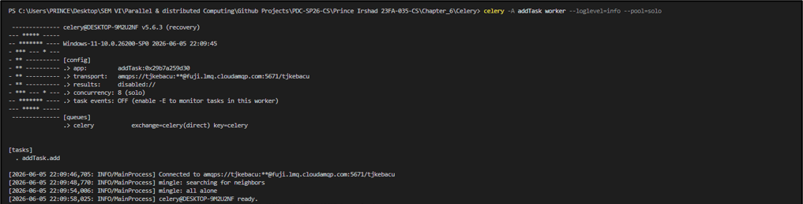

---

### addTask_main.py
* **What I Learned:** I learned how to trigger distributed processing tasks using the asynchronous `.delay()` system, observing how arguments can be passed away from the main thread without hanging the primary console.
* **How it Executes:** When launched, this main controller script invokes the registered function asynchronously. Instead of performing the math locally, it wraps the parameters inside a small payload package, flings it to the message queue, and exits instantly.
* **Code Understanding:**
  * `import addTask` brings the registered distributed application object into the current workspace context.
  * `addTask.add.delay(5, 5)` instructs the framework to skip local CPU registers, forcing the data bundle directly into RabbitMQ instead.
* **End Use:** Used as a trigger mechanism in web engines to initiate long-running scripts (like report generations or heavy mail merges) silently in the background.
* **Short Summary:** An execution controller that seamlessly dispatches calculations to a background network channel without waiting for answers.
* **Pros & Cons:**
  * **Advantages:** Frees up local command line instances immediately, maximizing client-side performance.
  * **Disadvantages:** If the target message broker drops offline or crashes, the execution script will stall or freeze entirely.
* **Output:**

---

## 2. PYRO4 DIRECTORY

### FIRST EXAMPLE

#### pyro_client.py
* **What I Learned:** I learned how to establish Remote Procedure Calls (RPC) using Pyro4 stubs, which allows a local script to interact with a class instance operating inside a totally separate memory space.
* **How it Executes:** The program takes a text string from the terminal, queries the network Name Server to locate where the exposed target object resides, establishes a virtual communication bridge, and requests remote execution.
* **Code Understanding:**
  * `Pyro4.Proxy("PYRONAME:server")` creates a local lookup handle that mirrors the structural behavior of the distant server class.
  * `server.welcomeMessage(name)` invokes a method over the network pipe, waiting for the remote return packet before displaying text.
* **End Use:** Used to build simple administration interfaces that connect to massive back-end services running on distinct server hardware.
* **Short Summary:** A basic remote user controller that sends user text data to a distant service and displays the returned response.
* **Pros & Cons:**
  * **Advantages:** Network operations feel exactly like writing standard, local object-oriented programming calls.
  * **Disadvantages:** Highly sensitive to network routing fluctuations; any drop in connection breaks the proxy instance immediately.
* **Output:**

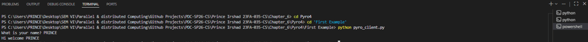

---

#### pyro_server.py
* **What I Learned:** I learned how to host remote object environments, configure a background communication Daemon pool, and publish logical identifiers into a central directory phonebook.
* **How it Executes:** The system spins up an endless listener cycle. It instantiates the target business logic, binds its structural footprint to the active naming directory under a string alias, and blocks to intercept incoming proxy data packets.
* **Code Understanding:**
  * `@Pyro4.expose` acts as a security wall, choosing exactly which class routines can be requested across open network pipes.
  * `daemon.requestLoop()` establishes an infinite listening block that keeps the host channel open for inbound data transactions.
* **End Use:** Perfect for setting up centralized data compute nodes or distributed engine blocks that multiple remote components need to utilize.
* **Short Summary:** A network object container that serves greeting tasks across low-level channels via a managed server environment.
* **Pros & Cons:**
  * **Advantages:** Offers clean method security and automates complex lower-tier connection tracking tasks entirely.
  * **Disadvantages:** Operates on a synchronous execution architecture that can bottleneck under sudden spikes of client traffic.
* **Output:**

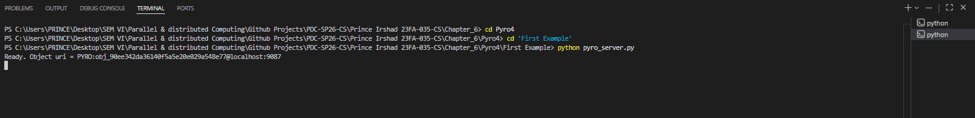

---

### SECOND EXAMPLE (CHAIN TOPOLOGY)

#### chainTopology.py
* **What I Learned:** I learned how to model abstract multi-node distributed ring networks, observing how recursive structures can transition seamlessly from one server node to another using lazy-loading proxy references.
* **How it Executes:** When a message array reaches this class, it checks whether its own identity is inside the track list. If it isn't, it appends its signature name, instantiates a link to its downstream target neighbor, and forwards the packet data.
* **Code Understanding:**
  * `if self.name in message:` sets up a critical distributed base condition that detects when a token has traveled a full, secure circle.
  * `result.insert(0, ...)` dynamically builds a tracking trace backlog as the execution returns back up the distributed call stack.
* **End Use:** Critical for constructing decentralized consensus models, token-ring automation patterns, or complex telemetry synchronization chains.
* **Short Summary:** A modular, object-oriented routing script that manages sequential, decentralized token forwarding across connected nodes.
* **Pros & Cons:**
  * **Advantages:** Exceptionally neat, predictable data flow routing with built-in loop detection logic.
  * **Disadvantages:** Multi-node tracking increases systemic memory use since multiple server instances must hold state simultaneously.
* **Output:**

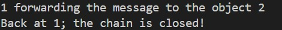

---

#### client_chain.py
* **What I Learned:** I learned how to inject seed data payloads into complex multi-stage server loops from an entirely disconnected exterior endpoint stub.
* **How it Executes:** The client queries the naming register specifically for Node 1. It delivers a starting list parameter into the system, waits while the multi-server ring executes behind the scenes, and prints the full path trace array.
* **Code Understanding:**
  * `Pyro4.core.Proxy("PYRONAME:example.chainTopology.1")` isolates the client from the rest of the chain, focusing exclusively on the initial node.
  * `obj.process(["hello"])` starts the multi-stage network algorithm, blocking the client terminal until the final response is generated.
* **End Use:** Used as a user dashboard or terminal starter to launch distributed system flows across a farm of computational machinery.
* **Short Summary:** A root client script that safely initializes an isolated token-passing ring mechanism and handles the terminal readout.
* **Pros & Cons:**
  * **Advantages:** Absolute abstraction; the client does not need to know the location or count of internal network machines.
  * **Disadvantages:** Completely vulnerable to middle-tier failures—if any node freezes, the client stays locked in an infinite wait block.
* **Output:**

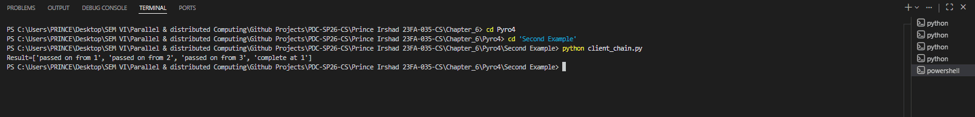

---

#### server_chain_1.py
* **What I Learned:** I learned how to launch the primary gateway container for a multi-system loop, assigning specific routing rules that map one node instance to another.
* **How it Executes:** The script creates a unique node entity named "1" and sets its target forwarding property directly to "2". It publishes this structural layout within the naming registry and holds port channels open for inbound tracking calls.
* **Code Understanding:**
  * `servername = "example.chainTopology." + current_server` sets up a distinct network name variable to prevent collisions inside the naming book.
  * `chainTopology.Chain("1", "2")` constructs a link that bridges this first machine directly to the next destination segment.
* **End Use:** Used to manage entry-point structures in pipeline topologies, acting as the primary reception node for incoming requests.
* **Short Summary:** A standalone server daemon initializing Node 1 of the circular cluster with a downstream routing map pointing to Node 2.
* **Pros & Cons:**
  * **Advantages:** Independent modular lifecycle tracking; can be restarted or isolated cleanly without modifying other nodes.
  * **Disadvantages:** If this server experiences local port failure, the client has no alternative gateway to enter the computation loop.
* **Output:**

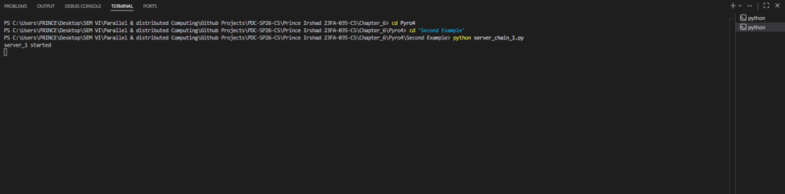

---

#### server_chain_2.py
* **What I Learned:** I learned how intermediate relay nodes operate in a distributed network cluster, managing data translation payloads without interacting with the original client source.
* **How it Executes:** This server launches an isolated background daemon for Node "2". It stands by until Node 1 drops an array data package into its proxy buffer, writes its own signature, and pushes the payload forward to Node 3.
* **Code Understanding:**
  * `obj = chainTopology.Chain("2", "3")` specifies the precise mid-stream routing mapping logic for this cluster link.
  * `ns.register(...)` maps the internal identity to the global phonebook, letting neighboring nodes resolve its exact hardware location.
* **End Use:** Used as load-balancing nodes or message brokers designed to filter, track, or relay workloads across internal networks.
* **Short Summary:** An intermediate network node daemon that intercepts payload arrays from Node 1 and routes them to Node 3.
* **Pros & Cons:**
  * **Advantages:** Allows developers to insert tracking logic, processing filters, or security boundaries right in the middle of a live data pipe.
  * **Disadvantages:** Adds an extra transport jump, which increases network propagation time across the architecture.
* **Output:**

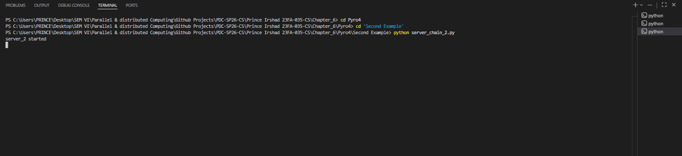

---

#### server_chain_3.py
* **What I Learned:** I learned how to close a distributed loop architecture properly by designing a final cluster node that targets the initial master instance, completing a full circle.
* **How it Executes:** Node "3" sits in an active listener cycle. When it processes the incoming data payload, its destination parameter routes back to Node "1", closing the ring structure and causing the distributed processing blocks to resolve successfully.
* **Code Understanding:**
  * `obj = chainTopology.Chain("3", "1")` creates the critical loop closure connection by mapping the final step back to the start point.
  * `daemon.requestLoop()` keeps the closing node active so it can monitor incoming packets from intermediate links.
* **End Use:** Essential for configuring token-passing networks or circular backup infrastructures where data must wrap back around to the origin.
* **Short Summary:** A termination node script that finishes the circular distributed cluster layout by routing traffic back to the entry node.
* **Pros & Cons:**
  * **Advantages:** Creates a fully balanced circular pipeline without needing specialized closing structures or complex controllers.
  * **Disadvantages:** If the target entry node drops offline during the final bounce, the entire loop breaks right at the finish line.
* **Output:**

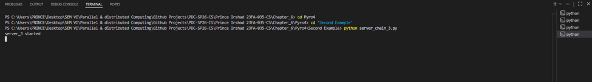

---

## 3. SOCKET DIRECTORY

### AddTask.py
* **What I Learned:** I learned how to build a message broker definition using alternative AMQP clients (`pyamqp`), configuring reliable queue mechanisms over raw socket ports.
* **How it Executes:** The script instantiates a standalone Celery profile layer, binding a basic addition task directly to the underlying systems of the local RabbitMQ message queue engine.
* **Code Understanding:**
  * `Celery('tasks', broker='pyamqp://guest@localhost//')` selects a pure Python messaging client layer to stream tasks safely over network ports.
  * `def add(x, y): return x + y` registers the foundational math module inside the distributed background framework.
* **End Use:** Used to construct internal worker definitions that communicate with broader infrastructure networks via basic messaging patterns.
* **Short Summary:** A backend setup that maps arithmetic functions to an explicit AMQP socket transport pipeline.
* **Pros & Cons:**
  * **Advantages:** Highly stable transmission framework featuring durable packet-delivery guarantees.
  * **Disadvantages:** Requires additional setup overhead since it relies completely on an external message queue engine.
* **Output:**

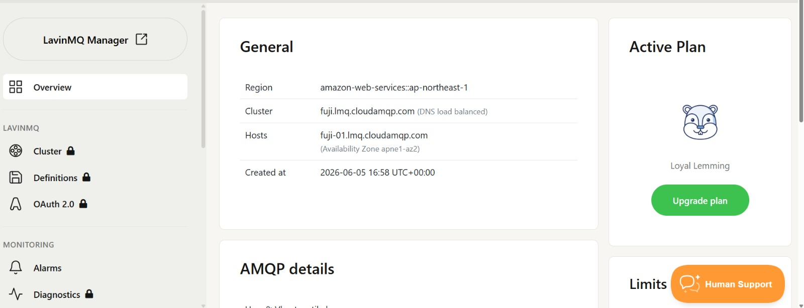

---

### addTask_main.py
* **What I Learned:** I learned how to interact with message clients over low-level socket-driven channels, exploring how parameters can be sent off without locking local interfaces.
* **How it Executes:** The runtime module initializes, accesses the target queue task function, forwards a raw parameters payload directly onto the network broker channel, and closes out immediately.
* **Code Understanding:**
  * `from addTask import add` links the task executor context directly to the pre-configured broker setup.
  * `add.delay(5, 5)` serializes the raw input parameters and fires them into the messaging queue asynchronously.
* **End Use:** Used as a quick terminal command to push items into processing systems without slowing down local terminal workflows.
* **Short Summary:** A quick trigger utility that dispatches arguments to an active AMQP message queue manager.
* **Pros & Cons:**
  * **Advantages:** Zero local processing delay; the main execution script exits almost instantly.
  * **Disadvantages:** Hard to verify if a task succeeded or failed locally without adding complex state-tracking code.
* **Output:**

**Execution Note:** This script triggers an asynchronous task directly to the external AMQP broker. Because it initializes, dispatches the arguments array payload, and detaches immediately without blocking the active thread, it does not produce a local synchronous command-line output trace.

---

### client.py
* **What I Learned:** I learned the basics of network layer communications by using low-level, connection-oriented TCP sockets to link directly with local server ports.
* **How it Executes:** The script instantiates a basic IPv4 socket descriptor, connects to the host machine's port 9999, reads the incoming raw data stream from the network buffer, and displays the decoded text string.
* **Code Understanding:**
  * `socket.socket(socket.AF_INET, socket.SOCK_STREAM)` configures a standard connection-oriented TCP link.
  * `s.recv(1024)` pauses execution completely until incoming byte data drops into the local network buffer cache.
* **End Use:** Foundational structure for building custom network utilities, light chat endpoints, or hardware connection tools.
* **Short Summary:** A minimalist TCP network client that downloads and decodes system time string blocks from a targeted service.
* **Pros & Cons:**
  * **Advantages:** High performance and lightweight footprint due to zero reliance on heavy third-party code libraries.
  * **Disadvantages:** Synchronous blocking mechanism; the client freezes completely if the server fails to reply.
* **Output:**

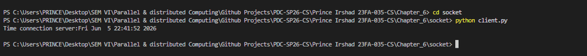

---

### client2.py
* **What I Learned:** I learned how to manage persistent binary data streams across network links, observing how to write raw incoming bytes into a local file system safely using continuous loops.
* **How it Executes:** The program establishes a link on port 60000, delivers an encoded greeting token, opens a local file template, and loops continuously to pull down and save chunks until the network data flow stops.
* **Code Understanding:**
  * `open('received.txt', 'wb')` configures the local file system to store exact raw bytes instead of text characters, preventing file corruption.
  * `if not data: break` provides an essential termination condition that breaks the data-collection loop when the server stops streaming.
* **End Use:** The baseline code pattern for building data download software, automated backup tools, or secure document sharing clients.
* **Short Summary:** A streaming TCP file download client that loops network packets directly into a physical disk file.
* **Pros & Cons:**
  * **Advantages:** Safely downloads very large files without overloading system memory since it writes data chunk-by-inch.
  * **Disadvantages:** Does not feature internal verification protocols (like hashing) to guarantee that a file wasn't corrupted during transmission.
* **Output:**

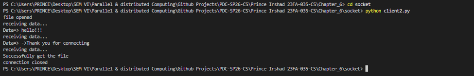

---

### server.py
* **What I Learned:** I learned how to assign a socket to a local port address, shift into active listening mode, and handle client incoming data requests inside a continuous server execution loop.
* **How it Executes:** The server reserves port 9999 and waits. When a client dials in, it accepts the connection, grabs the latest local system clock time, encodes it into raw bytes, and streams it back before dropping the session.
* **Code Understanding:**
  * `serversocket.bind((host, port))` attaches the network socket directly to a dedicated machine port configuration.
  * `clientsocket, addr = serversocket.accept()` breaks out of the waiting block, spawning a separate channel descriptor specifically to manage the incoming client.
* **End Use:** Used to build simple network services like centralized time daemons, status ping endpoints, or basic automation checks.
* **Short Summary:** A single-transaction TCP socket server that listens on port 9999 and distributes system timestamp logs to connecting nodes.
* **Pros & Cons:**
  * **Advantages:** Extremely low overhead and predictable resource management across single-client connections.
  * **Disadvantages:** Single-threaded design; if one client stalls during a transaction, all other waiting nodes are forced to queue up indefinitely.
* **Output:**

**Execution Note:** The terminal block shows the core TCP server actively bound to port 9999. It successfully enters a synchronous block state, freezing control flow to listen securely for any incoming client handshake transactions.

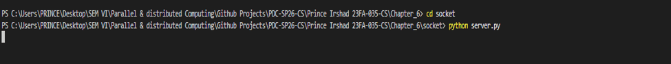

---

### server2.py
* **What I Learned:** I learned how to convert a local file into a network stream by reading its contents in binary chunks and pumping those packets through an active TCP session socket.
* **How it Executes:** The service monitors port 60000. When a client hits the entry point with a handshake keyword, the server opens its local data asset, slices it into 1024-byte packets, loops until the file is fully transmitted, and sends a closing message.
* **Code Understanding:**
  * `open(filename, 'rb')` reads the source file in binary mode to ensure the exact byte structure is preserved over the network.
  * `while (l): conn.send(l)` establishes a stable loop that pushes file data chunks out sequentially until the end of the file is reached.
* **End Use:** Foundational setup for hosting internal file distribution services, local application update platforms, or raw storage servers.
* **Short Summary:** A robust TCP file-streaming daemon that shares binary data blocks across open socket pipelines safely.
* **Pros & Cons:**
  * **Advantages:** Safe streaming flow; keeps loops completely synchronized, preventing data loss or partial file cuts.
  * **Disadvantages:** Synchronous blocking architecture can freeze completely if a client drops its link unexpectedly mid-transfer.
* **Output:**

